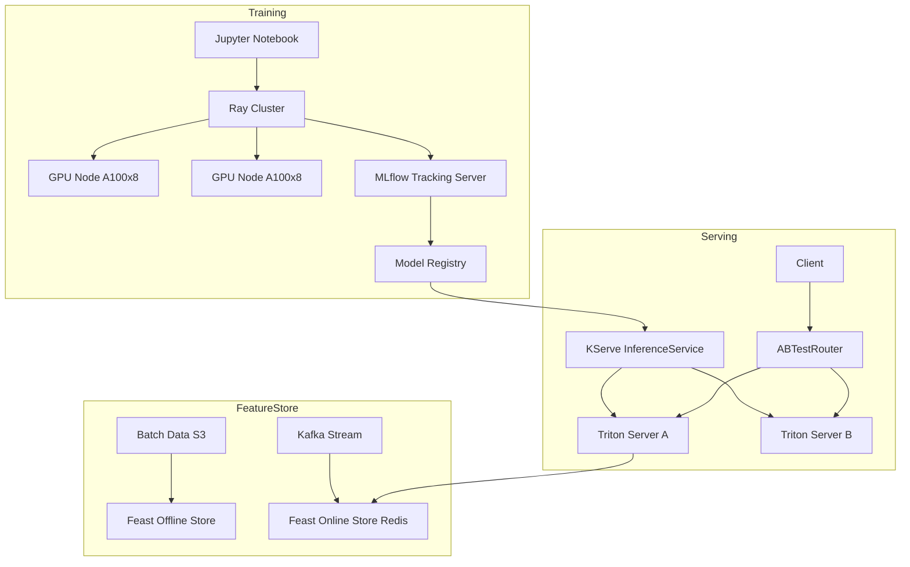
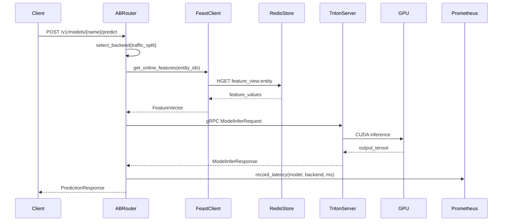

### システム全体アーキテクチャ図（Mermaid）

```mermaid
graph TB
  subgraph Training
    UserNotebook[Jupyter Notebook] --> RayCluster[Ray Cluster]
    RayCluster --> GPUNode1[GPU Node A100x8]
    RayCluster --> GPUNode2[GPU Node A100x8]
    RayCluster --> MLflow[MLflow Tracking Server]
    MLflow --> ModelRegistry[Model Registry]
  end
  subgraph Serving
    ModelRegistry --> KServe[KServe InferenceService]
    KServe --> TritonA[Triton Server A]
    KServe --> TritonB[Triton Server B]
    ABRouter[ABTestRouter] --> TritonA
    ABRouter --> TritonB
    Client --> ABRouter
  end
  subgraph FeatureStore
    BatchData[Batch Data S3] --> OfflineFeast[Feast Offline Store]
    StreamData[Kafka Stream] --> OnlineFeast[Feast Online Store Redis]
    TritonA --> OnlineFeast
  end
```

### 推論リクエストフロー（Mermaidシーケンス図）

```mermaid
sequenceDiagram
  Client->>ABRouter: POST /v1/models/{name}/predict
  ABRouter->>ABRouter: select_backend(traffic_split)
  ABRouter->>FeastClient: get_online_features(entity_ids)
  FeastClient->>RedisStore: HGET feature_view:entity
  RedisStore-->>FeastClient: feature_values
  FeastClient-->>ABRouter: FeatureVector
  ABRouter->>TritonServer: gRPC ModelInferRequest
  TritonServer->>GPU: CUDA inference
  GPU-->>TritonServer: output_tensor
  TritonServer-->>ABRouter: ModelInferResponse
  ABRouter->>Prometheus: record_latency(model, backend, ms)
  ABRouter-->>Client: PredictionResponse
```
