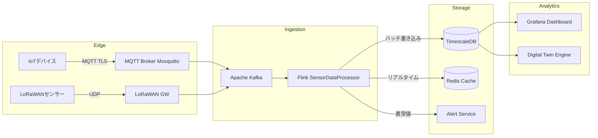
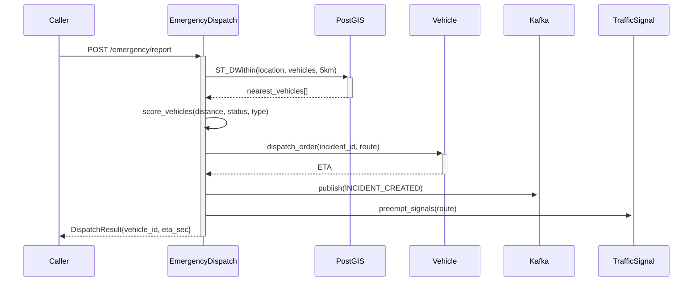

### IoTデータパイプライン図（Mermaid）

```mermaid
graph LR
  subgraph Edge
    IoT[IoTデバイス] -->|MQTT TLS| MQTTBroker[MQTT Broker Mosquitto]
    LoRa[LoRaWANセンサー] -->|UDP| LoRaGW[LoRaWAN GW]
  end
  subgraph Ingestion
    MQTTBroker --> Kafka[Apache Kafka]
    LoRaGW --> Kafka
    Kafka --> FlinkJob[Flink SensorDataProcessor]
  end
  subgraph Storage
    FlinkJob -->|バッチ書き込み| TimescaleDB[(TimescaleDB)]
    FlinkJob -->|リアルタイム| Redis[(Redis Cache)]
    FlinkJob -->|異常値| AlertService[Alert Service]
  end
  subgraph Analytics
    TimescaleDB --> Grafana[Grafana Dashboard]
    TimescaleDB --> DigitalTwin[Digital Twin Engine]
  end
```

### 緊急通報ディスパッチフロー（Mermaidシーケンス図）

```mermaid
sequenceDiagram
  Caller->>+EmergencyDispatch: POST /emergency/report
  EmergencyDispatch->>+PostGIS: ST_DWithin(location, vehicles, 5km)
  PostGIS-->>-EmergencyDispatch: nearest_vehicles[]
  EmergencyDispatch->>EmergencyDispatch: score_vehicles(distance, status, type)
  EmergencyDispatch->>+Vehicle: dispatch_order(incident_id, route)
  Vehicle-->>-EmergencyDispatch: ETA
  EmergencyDispatch->>+Kafka: publish(INCIDENT_CREATED)
  EmergencyDispatch->>+TrafficSignal: preempt_signals(route)
  EmergencyDispatch-->>-Caller: DispatchResult{vehicle_id, eta_sec}
```
