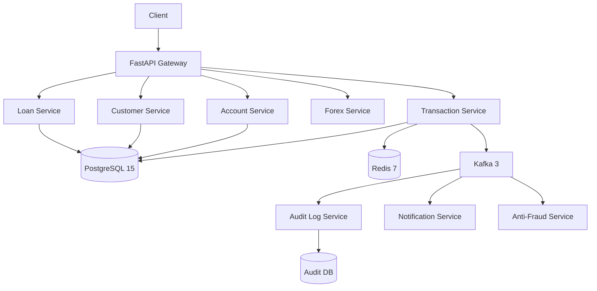
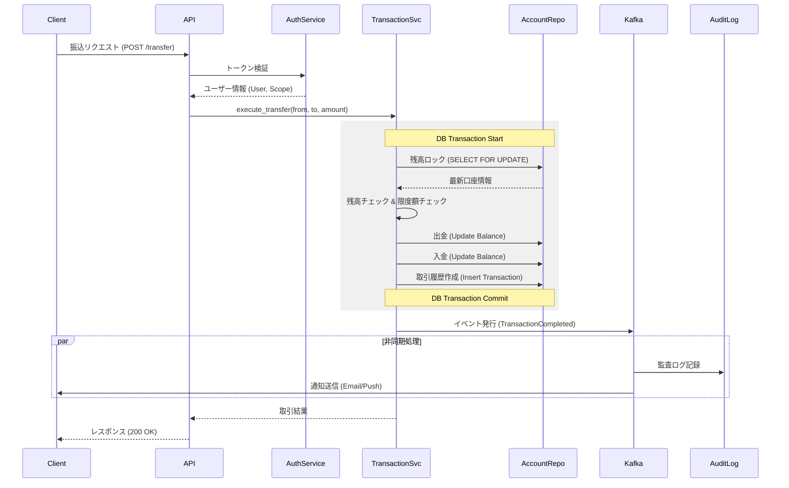

# Architecture

## 1. システム全体構成図（Mermaid）

## 2. レイヤードアーキテクチャの説明

本システムは、保守性と拡張性を確保するために、以下の4層構造（レイヤードアーキテクチャ）を採用しています。

- **API層 (FastAPI)**
  - エンドポイントの定義、リクエスト/レスポンスのスキーマ定義（Pydantic）、入力値バリデーションを担当します。
  - JWTによる認証、権限チェック（RBAC）を行います。
  - ビジネスロジックを含まず、Service層への委譲に徹します。

- **Service層**
  - アプリケーションのコアとなるビジネスロジックを実装します。
  - トランザクション境界を定義し、原子性を保証します。
  - ドメインモデルの操作、計算、ステート管理を行います。

- **Repository層 (SQLAlchemy ORM)**
  - データベースへのアクセスを抽象化します。
  - CRUD操作、複雑なクエリの実行を担当します。
  - ドメインオブジェクトと永続化データのマッピングを行います。

- **Infrastructure層**
  - ロギング、キャッシュ、メッセージキュー、外部API連携などの技術的な関心事を扱います。
  - ビジネスロジックから技術的詳細を分離し、テスト容易性を向上させます。

## 3. データフロー図（振込の例）

振込処理におけるデータの流れと主要な処理ステップを以下に示します。

## 4. 障害対応アーキテクチャ

高可用性とデータ整合性を維持するためのインフラ構成は以下の通りです。

- **PostgreSQL**
  - **Streaming Replication**: Primary 1台に対し、Replica 2台を配置。
  - **Sync Replication**: 少なくとも1台のReplicaへの書き込み確認を行うことで、データ損失を防ぎます。
  - **PgBouncer**: コネクションプーリングにより、大量の接続を効率的に処理します。

- **Redis**
  - **Sentinel構成**: 3台構成（Master 1, Replica 2）で、Sentinelによる監視と自動フェイルオーバーを実現します。
  - **用途**: セッション管理、キャッシュ、レートリミット、分散ロックに使用します。

- **Kafka**
  - **3ブローカー構成**: クラスタ内の3台のブローカーで構成。
  - **Replication Factor (RF)**: 3に設定し、データの耐久性を確保。
  - **min.insync.replicas**: 2に設定し、書き込みの一貫性と可用性のバランスをとります。

- **Kubernetes**
  - **3ノード構成**: コントロールプレーンおよびワーカーノードを冗長化。
  - **PodDisruptionBudget (PDB)**: ノードメンテナンス時などでも、最低限必要なPod数を維持する設定を行います。
  - **HPA (Horizontal Pod Autoscaler)**: CPU/メモリ使用率に応じたオートスケーリングを設定します。
