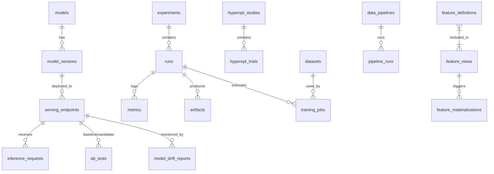

# 大規模AI/ML学習・推論統合プラットフォーム基盤 データベース設計書

## 1. データベース概要

本システムでは、主にリレーショナルデータベース (PostgreSQL) をメタデータ管理に使用し、時系列データやログデータには JSONB カラムを活用して柔軟性を持たせている。

*   **Database Engine**: PostgreSQL 15+ (Partitioning, Replication)
*   **ORM**: SQLAlchemy (Async)

## 2. テーブル一覧

以下の20テーブルで構成される。

1.  **models**: モデル定義情報
2.  **model_versions**: モデルバージョン管理
3.  **experiments**: 実験管理（MLflow Experiment相当）
4.  **runs**: 実験実行（Run）履歴
5.  **metrics**: 学習/評価メトリクス（時系列）
6.  **artifacts**: 生成物（モデルファイル、データ、プロット）管理
7.  **training_jobs**: 学習ジョブ実行管理
8.  **hyperopt_studies**: ハイパーパラメータ最適化スタディ
9.  **hyperopt_trials**: ハイパーパラメータ最適化トライアル
10. **feature_definitions**: 特徴量定義メタデータ
11. **feature_views**: 特徴量ビュー定義
12. **feature_materializations**: 特徴量具体化（Materialization）履歴
13. **serving_endpoints**: 推論エンドポイント設定
14. **inference_requests**: 推論リクエストログ（サンプリング）
15. **ab_tests**: A/Bテスト設定・状態
16. **data_pipelines**: データパイプライン定義
17. **pipeline_runs**: パイプライン実行履歴
18. **model_drift_reports**: モデルドリフト検知レポート
19. **gpu_utilization_logs**: GPUリソース使用ログ
20. **datasets**: データセット管理

## 3. ER図 (Mermaid)

