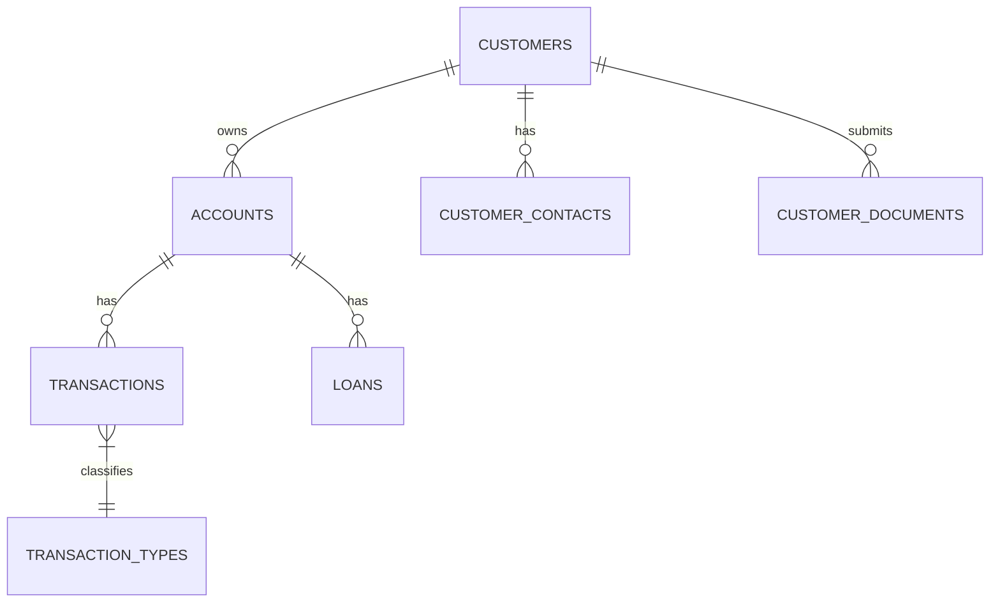

# データベース設計書 (DATABASE.md)

## 1. データベース概要

本システムは、高い信頼性と整合性が求められる勘定系データベースとして PostgreSQL 15 を採用する。
大量のトランザクションを処理するため、パーティショニングとインデックス戦略を適切に設計する。

- **DBMS**: PostgreSQL 15
- **拡張機能**: TimescaleDB (時系列データ管理用), pg_partman (パーティション管理用)
- **文字コード**: UTF-8
- **タイムゾーン**: UTC (アプリケーション層でJST変換)

## 2. ER図 (概要)

## 3. テーブル一覧 (Category別)

### 3.1 顧客系 (Customer)
- **customers**: 顧客マスタ。CIFの中核。
- **customer_contacts**: 連絡先情報（電話、Email）。
- **customer_documents**: 本人確認書類（KYC）。
- **customer_risk**: リスク評価情報（AMLスコア）。

### 3.2 口座系 (Account)
- **accounts**: 口座マスタ。残高を管理。
- **account_types**: 口座種別マスタ（普通、当座、定期）。
- **interest_rates**: 金利マスタ。
- **account_limits**: 取引限度額設定。

### 3.3 取引系 (Transaction)
- **transactions**: 取引履歴。日次パーティション推奨。
- **transaction_types**: 取引種別（入金、出金、振込、利息）。
- **transaction_details**: 取引詳細（振込先、メモ）。
- **pending_transactions**: 2PC用の一時保管テーブル。

### 3.4 為替・決済系 (Forex & Settlement)
- **forex_transactions**: 外国為替取引。
- **exchange_rates**: 為替レート履歴。
- **swift_messages**: SWIFT電文ログ。
- **zengin_records**: 全銀データログ。
- **settlements**: 決済マスタ。
- **rtgs_transactions**: 即時グロス決済取引。
- **net_positions**: ネット決済ポジション。
- **payment_orders**: 支払指図。

### 3.5 融資系 (Loan)
- **loans**: 融資契約マスタ。
- **loan_types**: 融資商品マスタ。
- **repayment_schedules**: 返済予定表。
- **repayment_history**: 返済実績。
- **collaterals**: 担保情報。
- **loan_applications**: 融資申込ワークフロー。

### 3.6 セキュリティ・監査 (Security & Audit)
- **users**: システム運用ユーザー。
- **roles**: 権限ロール定義。
- **audit_logs**: 操作監査ログ（7年保管）。
- **access_logs**: APIアクセスログ。
- **encryption_keys**: 暗号化キーバージョン管理。

### 3.7 バッチ・その他
- **batch_jobs**: バッチジョブ実行履歴。
- **interest_calc_log**: 利息計算ログ。

## 4. 共通仕様

- **主キー**: 原則として UUIDv4 または BIGSERIAL を使用。
- **日時カラム**: `created_at`, `updated_at` (TIMESTAMPTZ) を全テーブルに付与。
- **論理削除**: 物理削除は行わず、ステータスフラグまたは `deleted_at` で管理（監査要件による）。
- **金額**: `DECIMAL(19,4)` を使用し、浮動小数点誤差を排除。
