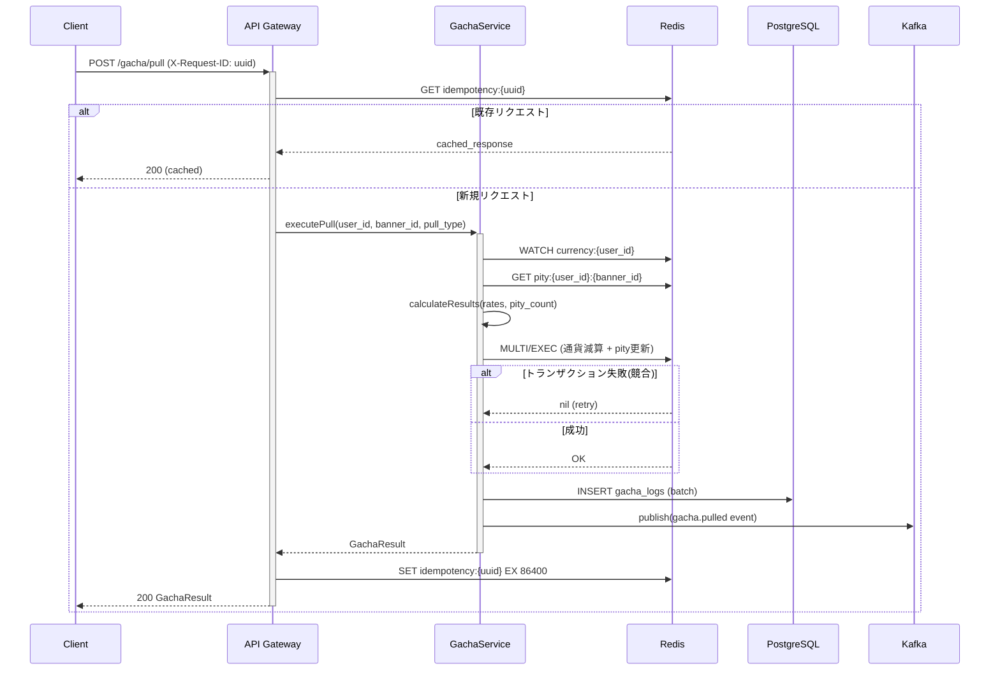
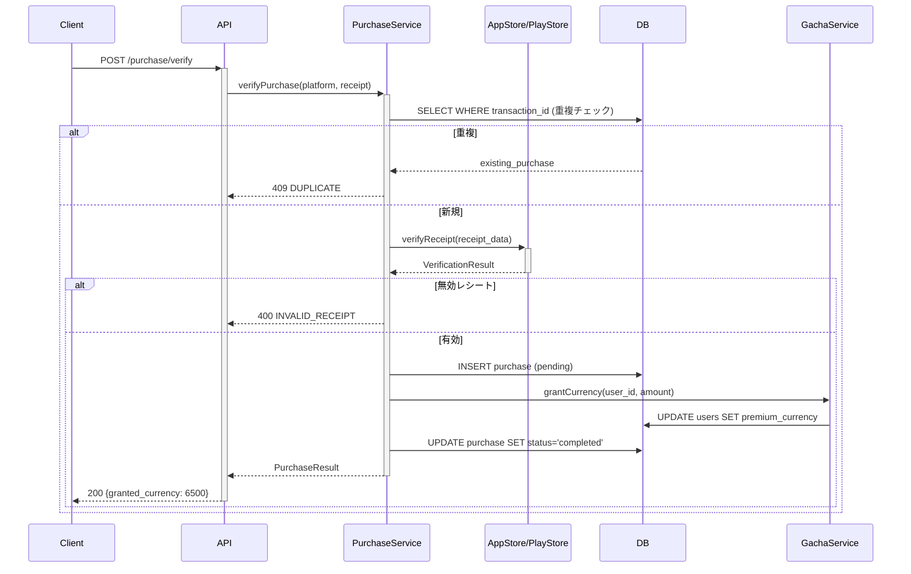

### ガチャ実行フロー

```mermaid
sequenceDiagram
    participant Client
    participant API as API Gateway
    participant GachaService
    participant Redis
    participant DB as PostgreSQL
    participant MQ as Kafka

    Client->>+API: POST /gacha/pull (X-Request-ID: uuid)
    API->>Redis: GET idempotency:{uuid}
    alt 既存リクエスト
        Redis-->>API: cached_response
        API-->>Client: 200 (cached)
    else 新規リクエスト
        API->>+GachaService: executePull(user_id, banner_id, pull_type)
        GachaService->>Redis: WATCH currency:{user_id}
        GachaService->>Redis: GET pity:{user_id}:{banner_id}
        GachaService->>GachaService: calculateResults(rates, pity_count)
        GachaService->>Redis: MULTI/EXEC (通貨減算 + pity更新)
        alt トランザクション失敗(競合)
            Redis-->>GachaService: nil (retry)
        else 成功
            Redis-->>GachaService: OK
        end
        GachaService->>DB: INSERT gacha_logs (batch)
        GachaService->>MQ: publish(gacha.pulled event)
        GachaService-->>-API: GachaResult
        API->>Redis: SET idempotency:{uuid} EX 86400
        API-->>-Client: 200 GachaResult
    end
```

### 課金フロー

```mermaid
sequenceDiagram
    participant Client
    participant API
    participant PurchaseService
    participant StoreAPI as AppStore/PlayStore
    participant DB
    participant GachaService

    Client->>+API: POST /purchase/verify
    API->>+PurchaseService: verifyPurchase(platform, receipt)
    PurchaseService->>DB: SELECT WHERE transaction_id (重複チェック)
    alt 重複
        DB-->>PurchaseService: existing_purchase
        PurchaseService-->>API: 409 DUPLICATE
    else 新規
        PurchaseService->>+StoreAPI: verifyReceipt(receipt_data)
        StoreAPI-->>-PurchaseService: VerificationResult
        alt 無効レシート
            PurchaseService-->>API: 400 INVALID_RECEIPT
        else 有効
            PurchaseService->>DB: INSERT purchase (pending)
            PurchaseService->>GachaService: grantCurrency(user_id, amount)
            GachaService->>DB: UPDATE users SET premium_currency
            PurchaseService->>DB: UPDATE purchase SET status='completed'
            PurchaseService-->>-API: PurchaseResult
            API-->>-Client: 200 {granted_currency: 6500}
        end
    end
```
