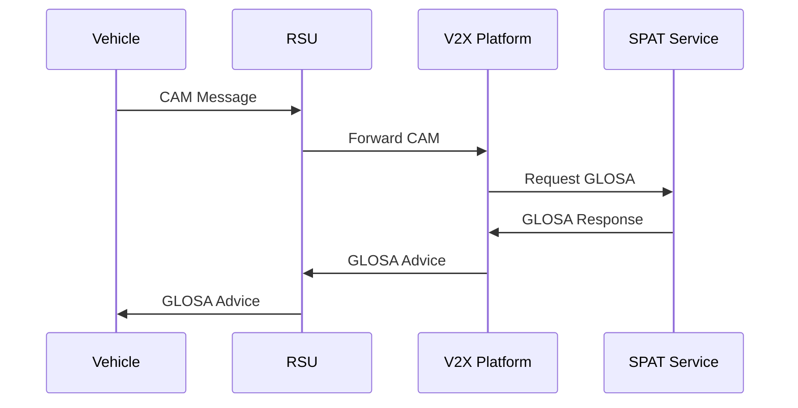
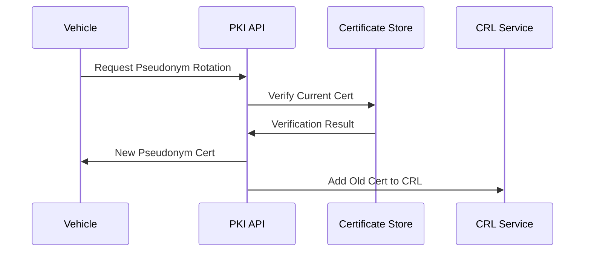
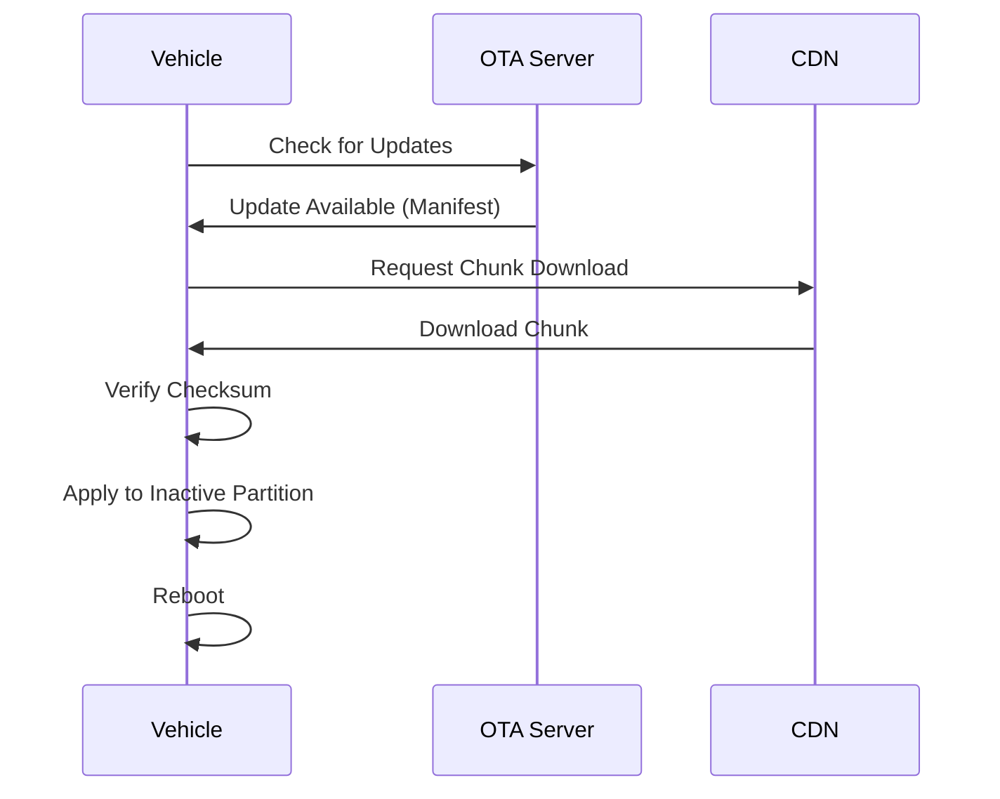

# Sequence Diagrams

## 1. CAM送受信 + GLOSA フロー

```mermaid
sequenceDiagram
    participant Vehicle
    participant RSU
    participant V2X_Platform as V2X Platform
    participant SPAT_Service as SPAT Service

    Vehicle->>RSU: CAM Message
    RSU->>V2X_Platform: Forward CAM
    V2X_Platform->>SPAT_Service: Request GLOSA
    SPAT_Service->>V2X_Platform: GLOSA Response
    V2X_Platform->>RSU: GLOSA Advice
    RSU->>Vehicle: GLOSA Advice
```

## 2. 仮名証明書ローテーションフロー

```mermaid
sequenceDiagram
    participant Vehicle
    participant PKI_API as PKI API
    participant Cert_Store as Certificate Store
    participant CRL_Service as CRL Service

    Vehicle->>PKI_API: Request Pseudonym Rotation
    PKI_API->>Cert_Store: Verify Current Cert
    Cert_Store->>PKI_API: Verification Result
    PKI_API->>Vehicle: New Pseudonym Cert
    PKI_API->>CRL_Service: Add Old Cert to CRL
```

## 3. OTA更新フロー

```mermaid
sequenceDiagram
    participant Vehicle
    participant OTA_Server as OTA Server
    participant CDN

    Vehicle->>OTA_Server: Check for Updates
    OTA_Server->>Vehicle: Update Available (Manifest)
    Vehicle->>CDN: Request Chunk Download
    CDN->>Vehicle: Download Chunk
    Vehicle->>Vehicle: Verify Checksum
    Vehicle->>Vehicle: Apply to Inactive Partition
    Vehicle->>Vehicle: Reboot
```
