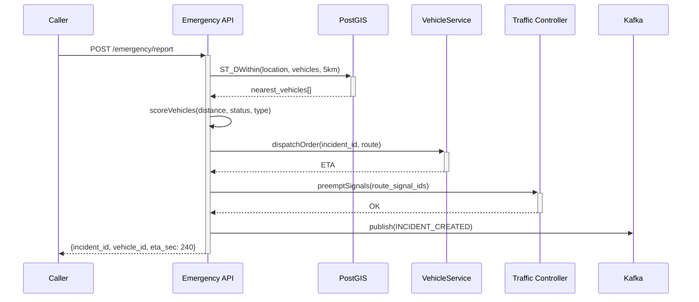
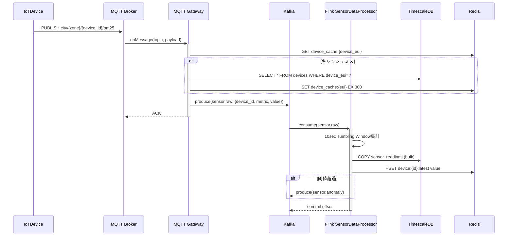

```mermaid
sequenceDiagram
    participant Caller
    participant EmergencyAPI as Emergency API
    participant PostGIS
    participant VehicleService
    participant TrafficCtrl as Traffic Controller
    participant Kafka

    Caller->>+EmergencyAPI: POST /emergency/report
    EmergencyAPI->>+PostGIS: ST_DWithin(location, vehicles, 5km)
    PostGIS-->>-EmergencyAPI: nearest_vehicles[]
    EmergencyAPI->>EmergencyAPI: scoreVehicles(distance, status, type)
    EmergencyAPI->>+VehicleService: dispatchOrder(incident_id, route)
    VehicleService-->>-EmergencyAPI: ETA
    EmergencyAPI->>+TrafficCtrl: preemptSignals(route_signal_ids)
    TrafficCtrl-->>-EmergencyAPI: OK
    EmergencyAPI->>Kafka: publish(INCIDENT_CREATED)
    EmergencyAPI-->>-Caller: {incident_id, vehicle_id, eta_sec: 240}
```

```mermaid
sequenceDiagram
    participant IoTDevice
    participant MQTT as MQTT Broker
    participant Gateway as MQTT Gateway
    participant Kafka
    participant Flink as Flink SensorDataProcessor
    participant TimescaleDB
    participant Redis

    IoTDevice->>+MQTT: PUBLISH city/{zone}/{device_id}/pm25
    MQTT->>+Gateway: onMessage(topic, payload)
    Gateway->>Redis: GET device_cache:{device_eui}
    alt キャッシュミス
        Gateway->>TimescaleDB: SELECT * FROM devices WHERE device_eui=?
        Gateway->>Redis: SET device_cache:{eui} EX 300
    end
    Gateway->>Kafka: produce(sensor.raw, {device_id, metric, value})
    Gateway-->>-MQTT: ACK
    Kafka->>+Flink: consume(sensor.raw)
    Flink->>Flink: 10sec Tumbling Window集計
    Flink->>TimescaleDB: COPY sensor_readings (bulk)
    Flink->>Redis: HSET device:{id}:latest value
    alt 閾値超過
        Flink->>Kafka: produce(sensor.anomaly)
    end
    Flink-->>-Kafka: commit offset
```
