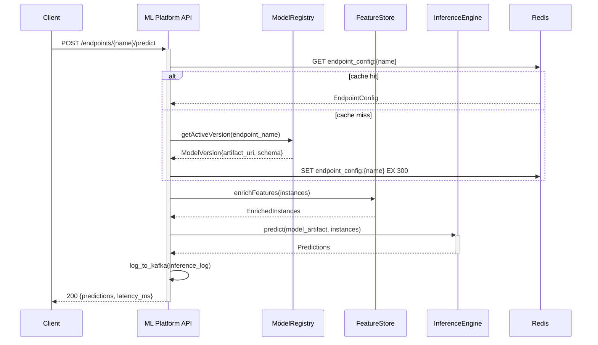
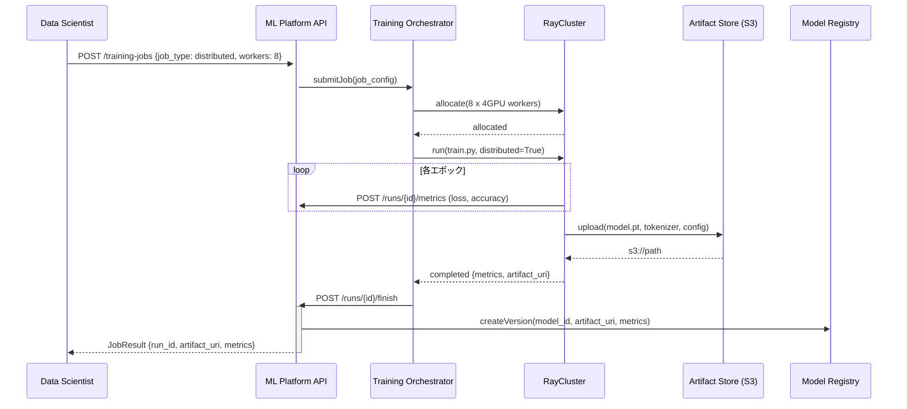

```mermaid
sequenceDiagram
    participant Client
    participant API as ML Platform API
    participant ModelRegistry
    participant FeatureStore
    participant InferenceEngine
    participant Redis

    Client->>+API: POST /endpoints/{name}/predict
    API->>Redis: GET endpoint_config:{name}
    alt cache hit
        Redis-->>API: EndpointConfig
    else cache miss
        API->>ModelRegistry: getActiveVersion(endpoint_name)
        ModelRegistry-->>API: ModelVersion{artifact_uri, schema}
        API->>Redis: SET endpoint_config:{name} EX 300
    end
    API->>FeatureStore: enrichFeatures(instances)
    FeatureStore-->>API: EnrichedInstances
    API->>+InferenceEngine: predict(model_artifact, instances)
    InferenceEngine-->>-API: Predictions
    API->>API: log_to_kafka(inference_log)
    API-->>-Client: 200 {predictions, latency_ms}
```

```mermaid
sequenceDiagram
    participant DataSci as Data Scientist
    participant API as ML Platform API
    participant TrainingOrch as Training Orchestrator
    participant RayCluster
    participant Artifact as Artifact Store (S3)
    participant Registry as Model Registry

    DataSci->>+API: POST /training-jobs {job_type: distributed, workers: 8}
    API->>TrainingOrch: submitJob(job_config)
    TrainingOrch->>RayCluster: allocate(8 x 4GPU workers)
    RayCluster-->>TrainingOrch: allocated
    TrainingOrch->>RayCluster: run(train.py, distributed=True)
    loop 各エポック
        RayCluster->>API: POST /runs/{id}/metrics (loss, accuracy)
    end
    RayCluster->>Artifact: upload(model.pt, tokenizer, config)
    Artifact-->>RayCluster: s3://path
    RayCluster-->>TrainingOrch: completed {metrics, artifact_uri}
    TrainingOrch->>+API: POST /runs/{id}/finish
    API->>Registry: createVersion(model_id, artifact_uri, metrics)
    API-->>-DataSci: JobResult {run_id, artifact_uri, metrics}
```
