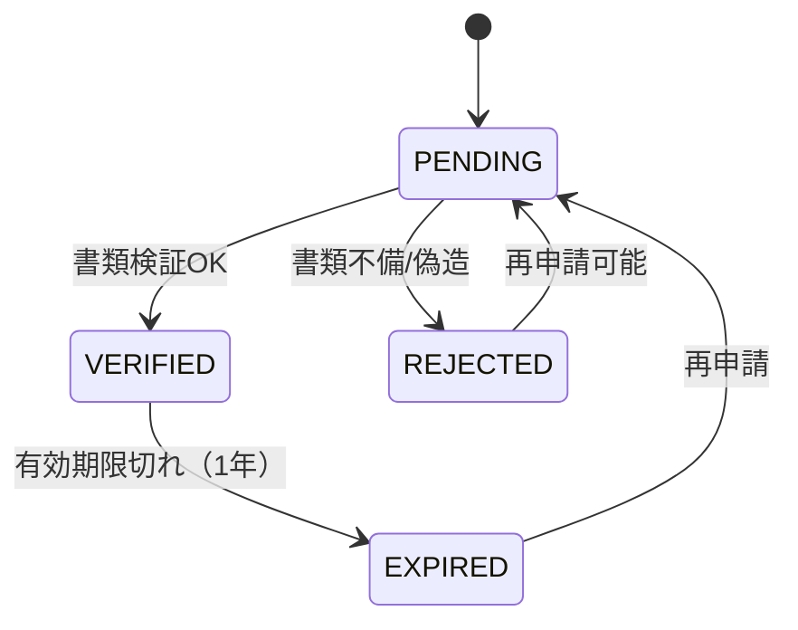

# Customer Service Specification

## 1. CustomerServiceの全メソッド詳細仕様

### register(dto: CustomerRegistrationDto) -> Customer

- **概要**: 新規顧客の登録処理を行います。
- **入力**:
  - `full_name`: 氏名（全角・半角スペース除去）
  - `date_of_birth`: 生年月日（18歳以上チェック）
  - `nationality`: 国籍コード（ISO 3166-1 alpha-3）
  - `tax_id`: マイナンバーまたは納税者番号
  - `email`: 連絡先メールアドレス
  - `phone`: 電話番号
- **バリデーション**:
  - `tax_id`が既に存在する場合は `DuplicateTaxIdError` を送出。
  - 氏名に禁止文字が含まれていないかチェック。
  - 生年月日が未来日付でないか、および成人年齢に達しているかチェック。
- **処理フロー**:
  1. **CIF番号採番**: `YYYYMMDD` + 6桁連番 の形式でユニークなIDを生成。
  2. **DB登録**:
     - `customers` テーブルにINSERT（`kyc_status`='PENDING'）。
     - `customer_contacts` テーブルにINSERT。
     - `customer_risk` テーブルにINSERT（初期スコア: 0, レベル: 'LOW'）。
  3. **監査ログ**: `audit_logs` に "CUSTOMER_REGISTERED" アクションを記録。
- **出力**: 作成された `Customer` エンティティ（`customer_id`, `cif_number` を含む）。
- **例外**: `DuplicateTaxIdError`, `ValidationError`

### verify_kyc(customer_id, documents: List[KycDocument]) -> KycResult

- **概要**: 本人確認書類の提出と検証プロセスを開始します。
- **入力**:
  - `customer_id`: 対象顧客ID
  - `documents`: 書類リスト（種類、画像データ/S3キー）
- **書類種別**:
  - `PASSPORT`: パスポート
  - `DRIVERS_LICENSE`: 運転免許証
  - `MY_NUMBER`: マイナンバーカード
- **処理フロー**:
  1. **書類保存**: `customer_documents` テーブルにメタデータをINSERT。
  2. **外部APIコール**: eKYCプロバイダ（外部サービス）へ書類画像を送信し、OCRおよび顔照合を実施。
  3. **ステータス更新**:
     - 検証成功時: `customers.kyc_status` を `VERIFIED` に更新。`customer_risk` の再評価トリガー。
     - 検証失敗時: `customers.kyc_status` を `REJECTED` に更新。
  4. **監査ログ**: `audit_logs` に "KYC_VERIFICATION_ATTEMPTED" アクションを記録。
- **出力**: `KycResult`（検証ステータス、理由コード）。
- **状態遷移図（Mermaid）**:

## 2. APIエンドポイント仕様

| メソッド | パス | 認証 | リクエストボディ | レスポンス | 説明 |
|---|---|---|---|---|---|
| POST | /api/v1/customers | Bearer (TELLER以上) | `CustomerRegistrationDto` | `CustomerResponse` (201) | 新規顧客登録 |
| GET | /api/v1/customers/{id} | Bearer | - | `CustomerResponse` (200) | 顧客情報取得 |
| PUT | /api/v1/customers/{id} | Bearer (MANAGER以上) | `CustomerUpdateDto` | `CustomerResponse` (200) | 顧客情報更新 |
| PUT | /api/v1/customers/{id}/kyc | Bearer (MANAGER以上) | `KycVerificationDto` | `KycResult` (200) | KYC検証実行 |
| GET | /api/v1/customers/{id}/risk | Bearer (AUDITOR以上) | - | `RiskProfile` (200) | リスクプロファイル参照 |
| DELETE | /api/v1/customers/{id} | Bearer (ADMIN) | - | - (204) | 顧客論理削除 |
