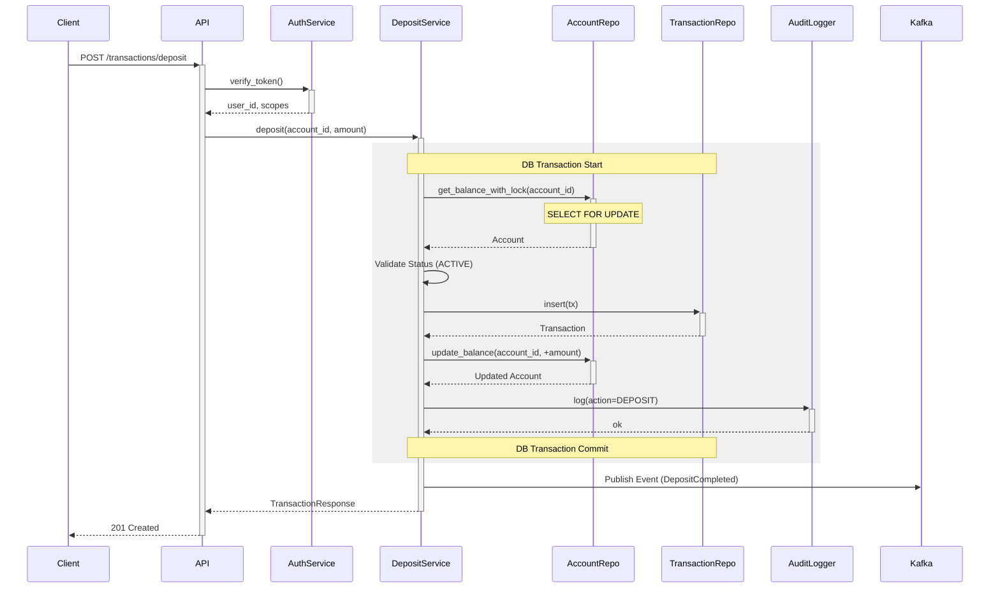

# Transaction Processing

## 1. 入出金処理フロー（Mermaidシーケンス図）

入金処理（Deposit）のシーケンス図を以下に示します。



## 2. デッドロック防止の仕組み（振込）

内部振込（Internal Transfer）において、送金元（Source）と送金先（Destination）の2つの口座レコードをロックする必要があります。この際、リクエストの順序によってデッドロックが発生する可能性があります。

**例:**
- Transaction A: Lock Account 1 -> Try Lock Account 2
- Transaction B: Lock Account 2 -> Try Lock Account 1
- **結果**: デッドロック

**対策:**
口座ID（UUIDや口座番号）に基づいて常に**一定の順序（昇順）**でロックを取得することで、デッドロックを回避します。

```python
# 正しい実装パターン（ドキュメント用疑似コード）

def execute_transfer(session, from_account_id, to_account_id, amount):
    # 1. ロック順序の決定（IDの昇順）
    sorted_ids = sorted([from_account_id, to_account_id])

    # 2. 順序通りにロックを取得
    account_1 = session.query(Account).filter_by(id=sorted_ids[0]).with_for_update().one()
    account_2 = session.query(Account).filter_by(id=sorted_ids[1]).with_for_update().one()

    # 3. オブジェクトの割り当て
    if from_account_id == sorted_ids[0]:
        from_account = account_1
        to_account = account_2
    else:
        from_account = account_2
        to_account = account_1

    # 4. バリデーションと更新処理
    if from_account.balance < amount:
        raise InsufficientBalanceError()

    from_account.balance -= amount
    to_account.balance += amount

    # ... 取引履歴作成など ...

    return TransferResult(status="SUCCESS")
```
