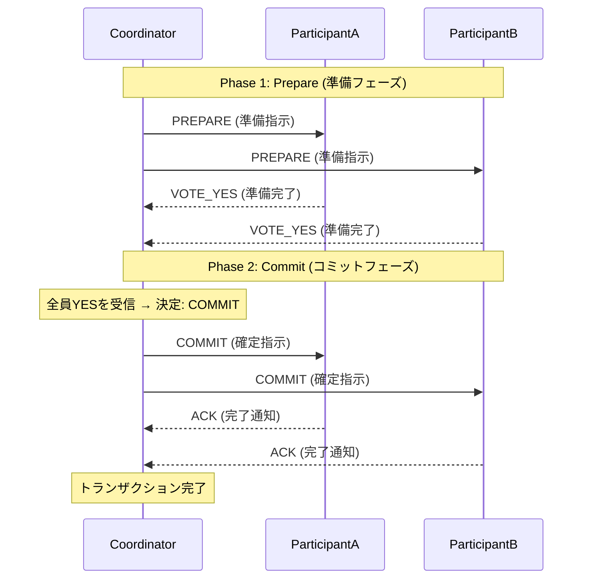

# ACID & Distributed Transactions

## 1. 2相コミットプロトコル（2PC）

複数のリソース（データベースやサービス）にまたがるトランザクションの整合性を保証するためのプロトコルです。コーディネーター（Coordinator）が各参加者（Participant）の状態を管理し、全員がコミット可能な場合のみ確定させます。

## 2. Sagaパターン（補償トランザクション）

長期間にわたる分散トランザクション（Long Running Transactions）において、ACID特性の代わりに結果整合性（Eventual Consistency）を採用するパターンです。各ステップでローカルトランザクションをコミットし、後続のステップで失敗が発生した場合、それまでの操作を取り消す「補償トランザクション」を実行します。

**外部振込（External Transfer）のSaga例:**

| ステップ | アクション (Do) | 補償トランザクション (Compensate) |
|---|---|---|
| 1. 出金予約 | `from_account` から送金額を引き落とし（またはロック）。 | `from_account` へ送金額を戻入（返金）。 |
| 2. 送金指示 | 外部銀行ネットワーク（SWIFT/全銀）へ送金リクエストを送信。 | 送金取消電文（Cancellation Request）を送信。 |
| 3. 送金確認 | 送金完了の応答を受信。 | - |
| 4. 完了処理 | 取引履歴のステータスを `COMPLETED` に更新。 | ステータスを `FAILED` に更新し、顧客へ通知。 |

## 3. 分離レベル設定 (Isolation Levels)

PostgreSQLにおけるトランザクション分離レベルの設定方針は以下の通りです。

- **SERIALIZABLE**
  - **用途**: 口座残高の更新処理、特に厳密な整合性が求められるケース。
  - **効果**: ファントムリード、ノンリピータブルリード、ダーティリードを完全に防止し、直列化可能性を保証します。二重出金の防止に必須です。
  - **注意**: リトライロジックの実装が必要です。

- **REPEATABLE READ**
  - **用途**: 利息計算バッチ、月次レポート生成。
  - **効果**: トランザクション開始時点のスナップショットを参照するため、集計中にデータが変更されても一貫した結果が得られます。

- **READ COMMITTED**
  - **用途**: 一般的な参照系クエリ（マイページ表示など）。
  - **効果**: コミットされたデータのみを参照します。パフォーマンスと整合性のバランスが良いデフォルト設定です。

- **READ UNCOMMITTED**
  - **用途**: 原則使用禁止。
  - **理由**: ダーティリード（未コミットデータの参照）が発生するため、金融システムでは許容されません。
